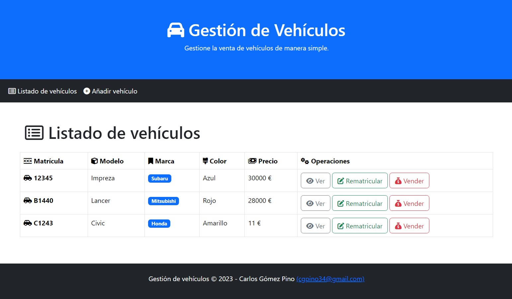
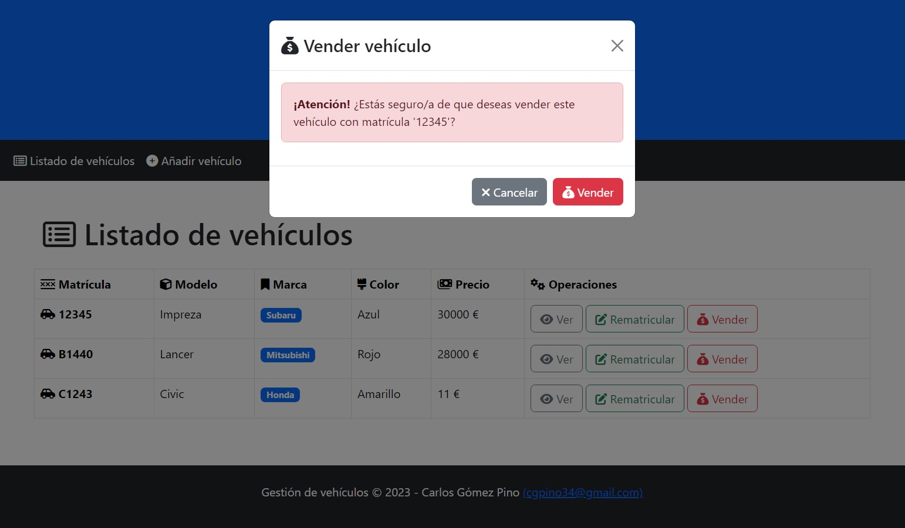
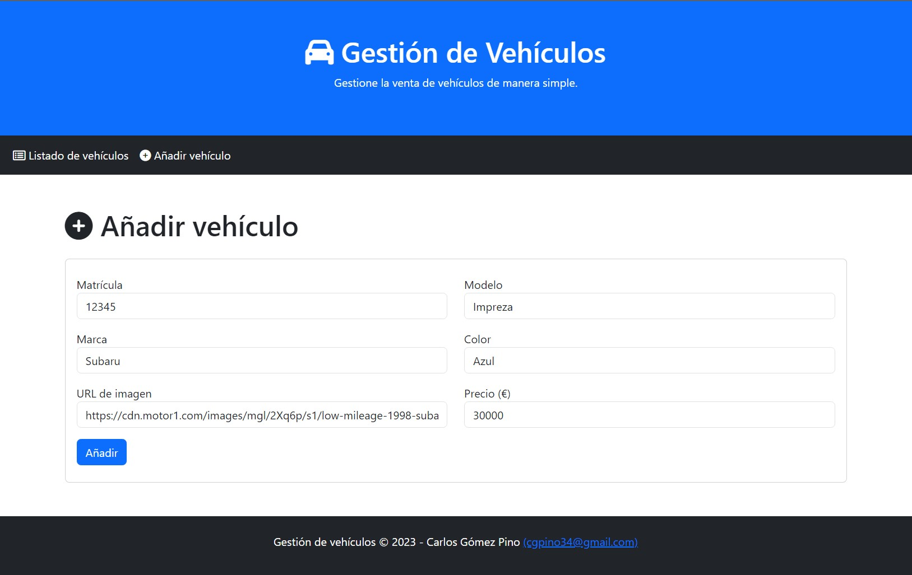
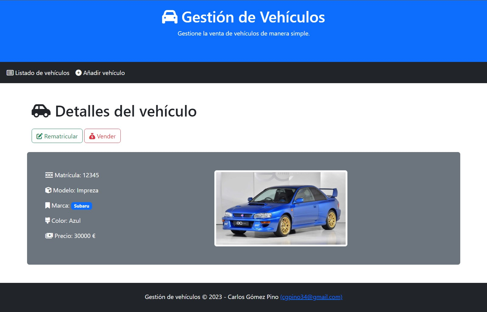

# Vehicles-Frontend
Frontend básico desarrollado con PHP Symfony que se conecta a una API de vehículos para consumirla, concretamente a esta: https://github.com/cgpino/Vehicles-API/.

## Requisitos
* PHP 8.2.
* Symfony 6.3 y Symfony CLI.
* Composer.

## Instalar el proyecto
* Clonar o descargar este repositorio
* Abrir una terminal en el directorio raíz del proyecto.
* Ejecutar el comando `composer install` en el directorio raíz del proyecto para instalar todas las dependencias del mismo.
* Configurar la conexión con la API a la que nos vayamos a conectar, para ello debemos abrir el archivo `.env` situado en la raíz y editar el valor de la variable `API_URL`, debemos simplemente indicar la URL de la API y el puerto (por defecto y siguiendo la documentación del otro proyecto, será el valor que ya está indicado en el propio archivo, por lo tanto no tendremos que tocar nada).
* Arrancar el servidor de la aplicación Frontend, ejecutando el comando el comando `php bin/console server:run -port 8080` en la raíz del proyecto, con ello tendremos la aplicación corriendo en `http://127.0.0.1:8080` (en este caso es importante indicar el puerto, ya que por defecto si no se le indica escogerá el `8000`, y en principio ya tenemos la API corriendo en dicho puerto).

## ¿Cómo se usa?
Una vez instalada y arrancada la aplicación, para poder probarla podemos ejecutar un navegador e ir a la URL `http://127.0.0.1:8080` (si es que le hemos indicado el puerto 8080), a partir de aquí ya tendremos nuestra aplicación web a través de la cual podemos navegar.

## Capturas de Pantalla

